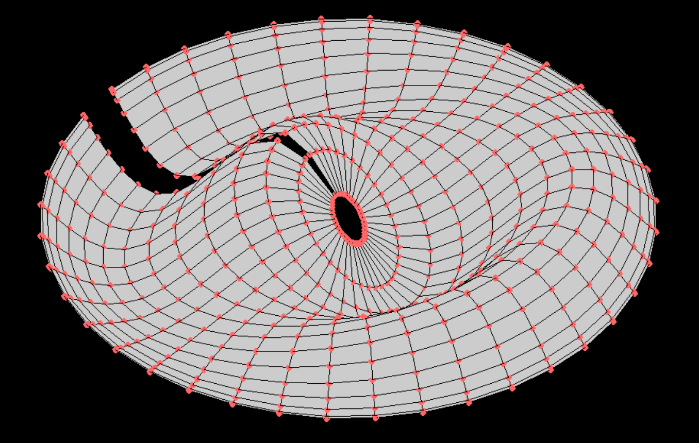

# Paquete de programas - Métodos numéricos II




## Integrantes del equipo

Del grupo 2403 de Métodos numéricos II:

- Carmona Maldonado Gibrán Isaí.
- Contreras Rojas Emanuel Saúl.
- Guzmán Ramos Carlos Emilio.


## Contenidos del programa

El programa puede

1. Resolver algunos sistemas de ecuaciones usando el método de Broyden.


## Compilación del programa

Si cuenta con la herramienta de GNU Make y GCC, puede ejecutar `make`. Si solo cuenta con el segundo, puedo usar el siguiente comando:

```
gcc -Wall -Werror -Wextra -Iheaders source/Funciones_basicas.c source/Matrices.c source/Opcion_1.c source/Opcion_2.c source/main.c -o Paquete_de_programas-Métodos_numéricos.exe -lm
```
